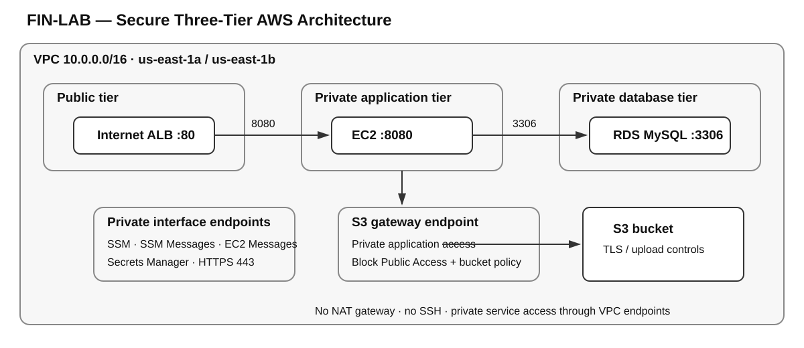
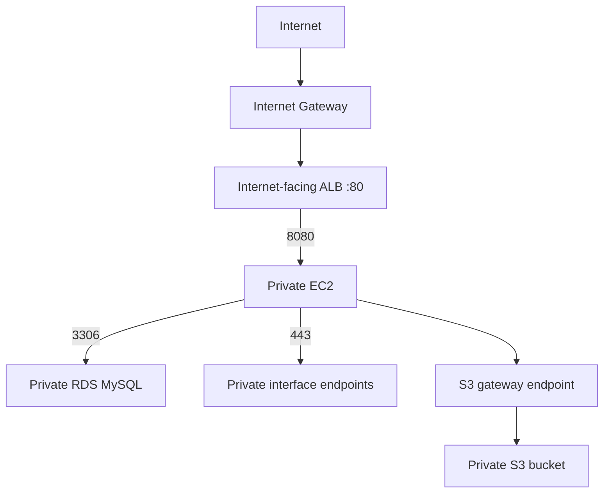

# 01 — Secure Three-Tier AWS Architecture

## Goal
Secure a three-tier AWS application using network isolation, least-privilege access, private endpoints and encryption.

## Diagram

## Build steps
| # | Step | Evidence |
|---|---|---|
| 1 | Build `FIN-LAB-VPC` with six subnets across `us-east-1a` and `us-east-1b`. Only the public tier uses the IGW; there is no NAT gateway. | VPC resource map |
| 2 | Place the application EC2 instance in the private app subnet with no public IPv4 address, no key pair, IMDSv2 required and the `FIN-LAB-SSM-ROLE` IAM role. | Private EC2 |
| 3 | Use private interface endpoints for SSM, Secrets Manager and related management traffic. Endpoint access is restricted to HTTPS from the app security group. | Network validation |
| 4 | Put the internet-facing ALB in the public tier and forward HTTP/80 traffic to the application on port 8080. | ALB application proof |
| 5 | Use private RDS MySQL on port 3306. IAM DB authentication is enabled and the master secret is managed by Secrets Manager. | RDS private connectivity |
| 6 | Add the S3 gateway endpoint, Block Public Access and bucket-policy controls for TLS and upload encryption. | S3 policy test |
| 7 | Validate intended and denied paths with connectivity tests and Reachability Analyzer. | Reachability Analyzer |

## What broke & fix
| Issue | Root cause | Fix |
|---|---|---|
| SSM was not connected | App SG had no HTTPS egress to the endpoint SG. | Added TCP/443 egress to the endpoint SG. |
| Secrets Manager failed at network level, then with `AccessDenied` | No endpoint initially; then no IAM permission. | Added the endpoint and a one-ARN `GetSecretValue` policy. |
| ALB target was unhealthy | Nothing was listening on port 8080. | Created and enabled the `finlab-web` systemd service. |
| S3 policy denied normal uploads | Earlier conditions treated a missing encryption header as a denial. | Iterated the condition logic until plain upload was allowed while the tested KMS upload was denied. |

## Proof
- **Blocked:** direct internet access, EC2 API access and DB port `22`.
- **Open:** DB `3306`, SSM `443`, Secrets Manager `443` and S3 `443`.
- Interface endpoints resolved to private `10.0.x.x` addresses.
- Reachability Analyzer showed `app-to-db-3306` **Reachable** and `igw-to-app-22` **Not reachable**.
- The ALB served the application while the application instance remained private.
- Plain S3 upload succeeded; the tested `--sse aws:kms` upload was denied by the bucket policy.

## Lab vs production
| Lab | Production |
|---|---|
| One EC2 instance | Auto Scaling across two AZs |
| Single-AZ RDS | Multi-AZ RDS |
| HTTP only | ACM certificate, HTTPS and WAF |
| No VPC Flow Logs; backups disabled | VPC Flow Logs and backups with PITR |
| Manual console configuration using root | Terraform, IAM Identity Center and no root usage |
