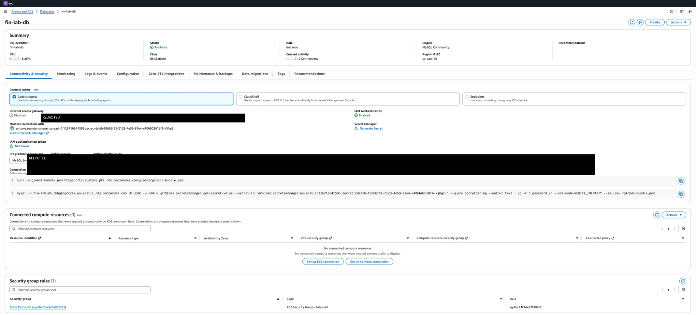
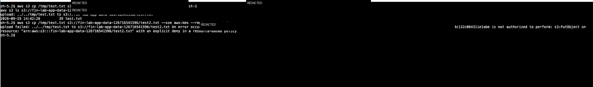

# 01 — Secure Three-Tier AWS Architecture

## Goal

Build a three-tier AWS application with public ingress at the load balancer while keeping the application and database layers private. The design uses security-group-to-security-group rules, VPC endpoints for private AWS service access, least-privilege IAM and explicit connectivity validation.

## Build steps

### 1. Build the VPC and subnet tiers

Created `FIN-LAB-VPC` (`10.0.0.0/16`) across `us-east-1a` and `us-east-1b` with two public subnets, two private application subnets and two private database subnets. Each tier has its own route table. Only the public route table has `0.0.0.0/0` to `FIN-LAB-igw`; no NAT gateway is used.

### 2. Keep the application instance private

`FIN-LAB-APP-Private` runs in the private application tier with no public IPv4 address, no key pair, IMDSv2 required and the `FIN-LAB-SSM-ROLE` role. The instance is managed through Systems Manager rather than SSH.

### 3. Provide private access to AWS management and secret services

Added VPC interface endpoints for `ssm`, `ssmmessages`, `ec2messages` and Secrets Manager. Endpoint security-group ingress is limited to HTTPS (`443`) from the application security group.

The validation run from the instance shows the intended distinction: direct internet and EC2 API access are blocked, while SSM, Secrets Manager and S3 resolve and connect through private paths.

### 4. Expose only the load balancer publicly

The ALB is internet-facing in the public subnets and listens on HTTP/80. It forwards to `fin-lab-app-tg` on port `8080`. The application security group allows `8080` only from the ALB security group.

### 5. Keep the database private and restrict access to the app tier

`fin-lab-db` is an encrypted RDS MySQL instance in the private DB subnet group across both AZs. It is not public, IAM DB authentication is enabled and the RDS-managed master secret is stored in Secrets Manager. The DB security group allows `3306` only from the application security group.

### 6. Keep application data on private S3 paths

The application uses an S3 gateway endpoint. The bucket has Block Public Access enabled and bucket-policy controls covering TLS and upload encryption behavior.

The final test allowed the normal upload path and denied the tested `--sse aws:kms` request.

### 7. Validate intended and denied paths

Reachability Analyzer was used to test the two security questions that matter to the design: can the private application reach the database on `3306`, and can the internet gateway reach the private application on `22`?

The observed results were `app-to-db-3306` **Reachable** and `igw-to-app-22` **Not reachable**. The denied internet-to-private path was explained by both private-IP ingress limitations and the absence of a matching security-group ingress rule.

## What broke & fix

### SSM was initially not connected

The agent could not reach the private SSM endpoint because the application security group had no HTTPS egress to the endpoint security group. Adding TCP/443 egress to the endpoint SG restored the path.

### Secrets Manager failed in two different ways

The first failure was network-level because the endpoint did not exist. After the endpoint was added, the request reached the service but returned `AccessDenied` because the role had no permission. The fix was a one-ARN `secretsmanager:GetSecretValue` policy on `FIN-LAB-SSM-ROLE`.

### The ALB target was unhealthy

The load balancer had no healthy backend because nothing was listening on port `8080`. A small Python web server was created as a `systemd` service on the private instance. Once the service was active, the ALB returned the application page.

### The first S3 bucket-policy condition was too broad

The first policy version used `StringNotEquals`, which treated the missing encryption header as a mismatch and denied normal uploads. A second attempt with `StringNotEqualsIfExists` still did not produce the required behavior. The final logic used a `Null: false` guard together with `StringNotEquals`, allowing the plain upload and denying the tested KMS upload.

## Security proof

- **Blocked:** direct internet access, direct EC2 API access and DB `22`.
- **Allowed:** DB `3306`, SSM `443`, Secrets Manager `443` and S3 `443`.
- Interface endpoints resolved to private `10.0.x.x` addresses.
- `app-to-db-3306` was **Reachable**.
- `igw-to-app-22` was **Not reachable**.
- The ALB served the application without giving the EC2 instance a public IP.
- Plain S3 upload succeeded while the tested `--sse aws:kms` upload was denied.

## Lab vs production

| Lab | Production hardening |
|---|---|
| One EC2 instance | Auto Scaling across two AZs |
| RDS lab topology | Multi-AZ database configuration |
| HTTP-only ALB | ACM TLS, HTTPS and WAF |
| No VPC Flow Logs in the lab | VPC Flow Logs, backups and PITR |
| Manual console configuration | Infrastructure as code and centralized identity |
