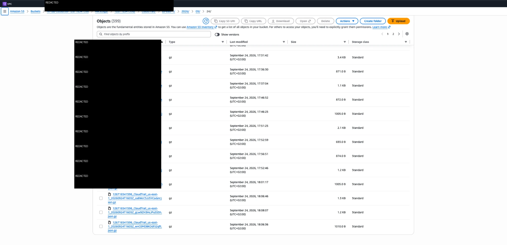
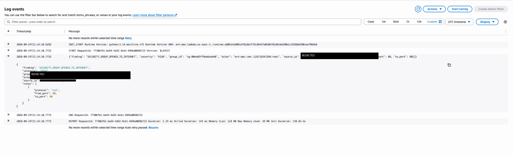

# 02 — Automated Threat Detection & Response

## Goal

Detect a security-group ingress change that opens a service to the internet, preserve enough audit context to identify the actor and produce a structured finding that drives an incident-response path.

## Build steps

### 1. Enable CloudTrail logging

Created the `fin-lab-trail` CloudTrail trail and delivered its logs to a versioned S3 bucket with log-file validation enabled.



### 2. Match the security-group change event

The EventBridge rule `fin-lab-detect-open-sg` matches EC2 CloudTrail events with detail-type `AWS API Call via CloudTrail` and event name `AuthorizeSecurityGroupIngress`.


### 3. Invoke the detection Lambda

The matching event invokes `FIN-LAB-Lambda`. The function evaluates the change and emits a structured finding to CloudWatch Logs.



### 4. Prove the detection with a controlled test

A dedicated lab security group was opened on HTTP/80 to `0.0.0.0/0`. This was the final successful test case because it represented an unmistakable internet-exposure change and triggered the detection path.


### 5. Preserve actor and network context

A separate CloudTrail event showed activity through `FIN-LAB-SSM-ROLE`, a private source address (`10.0.11.209`) and an SSM VPC endpoint. Sensitive account/access-key material in the source evidence has been redacted in the repository copy.


## What broke & fix

The first test used SSH/22 and produced no finding. The EventBridge Enhanced builder had not actually saved the intended rule. The rule was rebuilt with the Advanced builder, then retested with HTTP/80 until the finding appeared.

The lesson is operational: a detection that has never fired under a controlled test is still a hypothesis.

## Observed finding

The resulting record was structured as:

```json
{
  "finding": "SECURITY_GROUP_OPENED_TO_INTERNET",
  "severity": "HIGH",
  "group_id": "sg-00ee03ff9ea6eda40",
  "actor": "arn:aws:iam::[REDACTED]:root",
  "rules": [
    {"protocol": "tcp", "from_port": 80, "to_port": 80}
  ]
}
```

The CloudWatch screenshot shows the same finding with the source IP field redacted.


## Response runbook

1. **Triage** — identify the affected resource, actor and whether the change was approved.
2. **Contain** — revoke unauthorized ingress and preserve the CloudTrail record.
3. **Escalate** — investigate root-user activity as a separate security finding.

## Next production hardening

| Lab | Production / next step |
|---|---|
| Finding recorded in CloudWatch Logs | SNS/Slack notification |
| Manual containment | Auto-revoke unapproved rules after a dry run |
| Basic internet-exposure detection | Tag-based allowlist for legitimate ALB rules |
| `AuthorizeSecurityGroupIngress` coverage | Add `ModifySecurityGroupRules` and IPv6 `::/0` |
| CloudTrail + custom Lambda | Add GuardDuty, AWS Config and Security Hub |
| Security-group test case | Extend to S3 upload malware scanning and quarantine |
