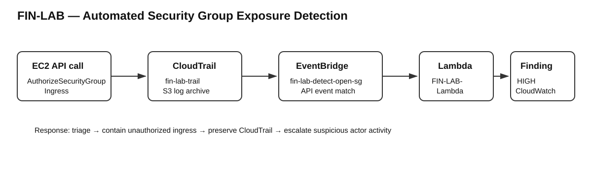
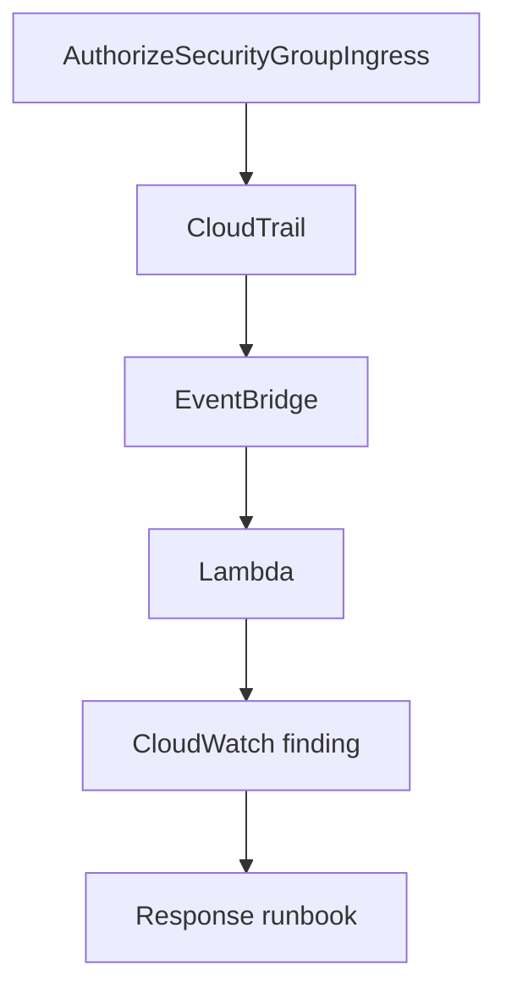

# 02 — Automated Threat Detection & Response

## Goal
Detect security-group ingress changes that expose a service to the internet, create an actionable finding and define a response path.

## Diagram




## Build steps
| # | Step | Evidence |
|---|---|---|
| 1 | Send CloudTrail activity to an S3 bucket with versioning and log-file validation. | CloudTrail log bucket |
| 2 | Match EC2 CloudTrail events with `AuthorizeSecurityGroupIngress`. | EventBridge rule |
| 3 | Route matching events to `FIN-LAB-Lambda`, which emits a structured finding to CloudWatch Logs. | Detection finding |
| 4 | Test with the lab security group opened to the internet. The final successful test used HTTP/80 from `0.0.0.0/0`. | Test security group |
| 5 | Use CloudTrail attribution to identify the actor, source and VPC endpoint context. | CloudTrail attribution |

## What broke & fix
| Issue | Root cause | Fix / lesson |
|---|---|---|
| Initial SSH/22 test produced no finding | The EventBridge Enhanced builder silently failed to save the intended rule. | Rebuilt the rule with the Advanced builder and retested. A detection that has never fired is a hypothesis. |

## Proof
```json
{
  "finding": "SECURITY_GROUP_OPENED_TO_INTERNET",
  "severity": "HIGH",
  "group_id": "sg-00ee03ff9ea6eda40",
  "actor": "arn:aws:iam::[REDACTED]:root",
  "rules": [{"protocol":"tcp","from_port":80,"to_port":80}]
}
```

A separate CloudTrail event showed the application using `FIN-LAB-SSM-ROLE`, a private source address and an SSM VPC endpoint.

**Response runbook**
1. **Triage:** Identify the affected resource, actor and approval status.
2. **Contain:** Revoke unauthorized ingress and preserve the CloudTrail record.
3. **Escalate:** Investigate root-user activity as a separate finding.

## Lab vs production
| Lab | Production / next step |
|---|---|
| Finding recorded in CloudWatch Logs | SNS/Slack notification |
| Manual containment | Auto-revoke unapproved rules; dry run first |
| Basic internet-exposure detection | Tag-based allowlist for legitimate ALB rules |
| `AuthorizeSecurityGroupIngress` coverage | Add `ModifySecurityGroupRules` and IPv6 `::/0` |
| CloudTrail + custom Lambda detection | Add GuardDuty, AWS Config and Security Hub |
| Security-group test scenario | Extend testing to PDF uploads with GuardDuty Malware Protection, quarantine and alerting |
