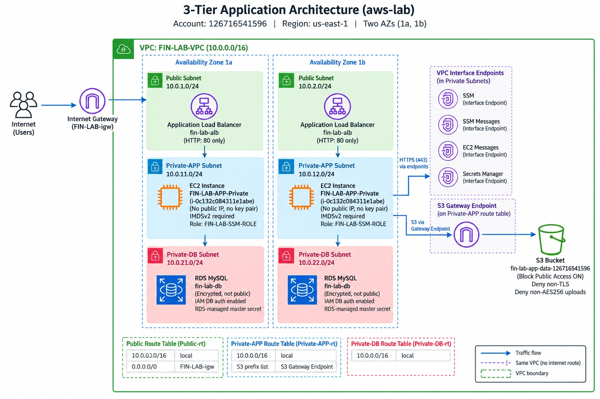
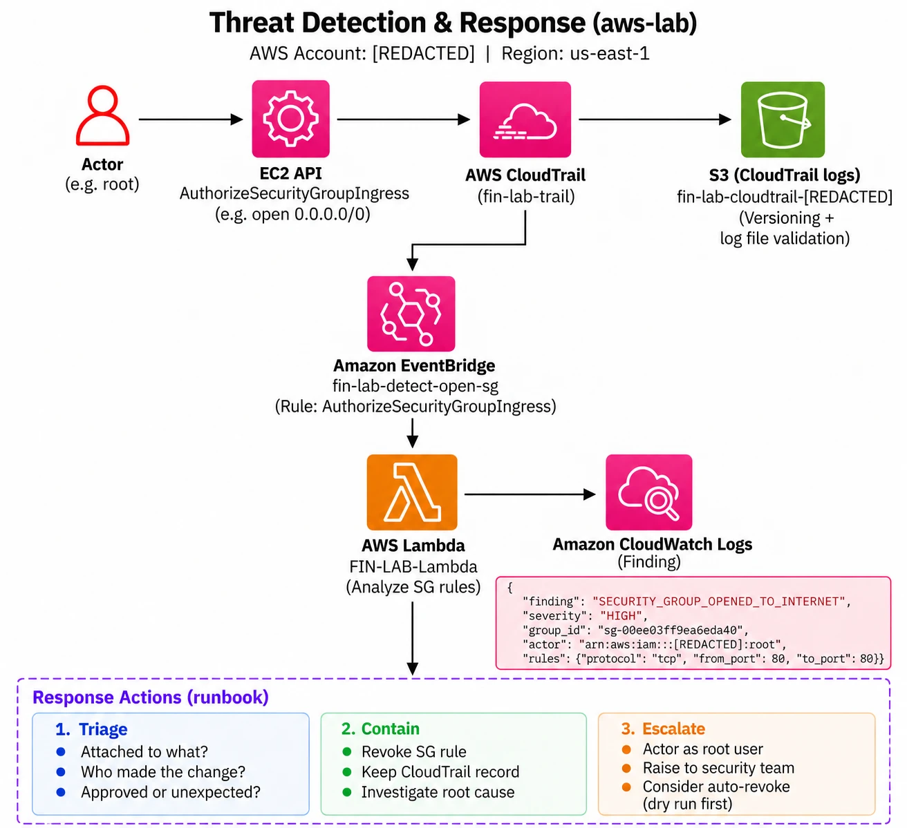

# AWS Cloud Security Lab

**Region:** `us-east-1` · **Built:** 19–25 September 2026

A hands-on AWS security lab built manually in the AWS Console. The lab demonstrates network isolation, private AWS service access, least-privilege access, security validation, CloudTrail monitoring and event-driven threat detection.

## Evidence pack

### Write-ups

| # | Write-up | Focus |
|---|---|---|
| 01 | [Secure Architecture](01-secure-architecture.md) | Three-tier AWS architecture, private endpoints, access controls and network validation |
| 02 | [Threat Detection & Response](02-threat-detection-response.md) | CloudTrail, EventBridge, Lambda, detection findings and incident response |

### Architecture diagrams

#### 1. Three-Tier Application Architecture
VPC across two AZs with the public ALB, private application tier, private database tier, route tables, VPC interface endpoints and S3 gateway endpoint.

#### 2. Threat Detection & Response
CloudTrail, EventBridge, Lambda and CloudWatch Logs detection path, with the triage, contain and escalate runbook.

