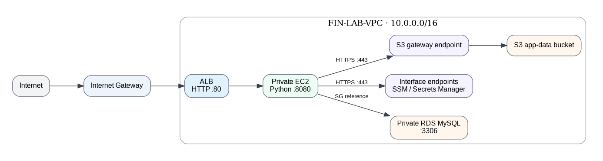
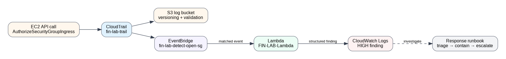

# AWS Cloud Security Lab

**Region:** `us-east-1` · **Built:** 19–25 September 2026

A hands-on AWS security lab built manually in the AWS Console. The lab demonstrates network isolation, private AWS service access, least-privilege access, security validation, CloudTrail monitoring and event-driven threat detection.

## Evidence pack

### Write-ups

| # | Write-up | Focus |
|---|---|---|
| 01 | [Secure Architecture](01-secure-architecture.md) | Three-tier AWS architecture, private endpoints, access controls and network validation |
| 02 | [Threat Detection & Response](02-threat-detection-response.md) | CloudTrail, EventBridge, Lambda, detection findings and incident response |

### Architecture diagrams

#### 1. Secure Three-Tier Architecture
Traffic path from the internet through the public ALB to the private application tier, with private access to RDS, S3 and AWS services through VPC endpoints.

#### 2. Threat Detection Pipeline
CloudTrail, EventBridge, Lambda and CloudWatch Logs detection path, ending in the response runbook.

#### 3. AWS Lab Overview
Secure application architecture alongside the threat-detection path.

#### 4. VPC Topology
VPC, subnet tiers, route boundaries, security groups and private AWS service access.

#### 5. Three-Tier Application
Public ALB, private application tier, private database tier and endpoint paths.

